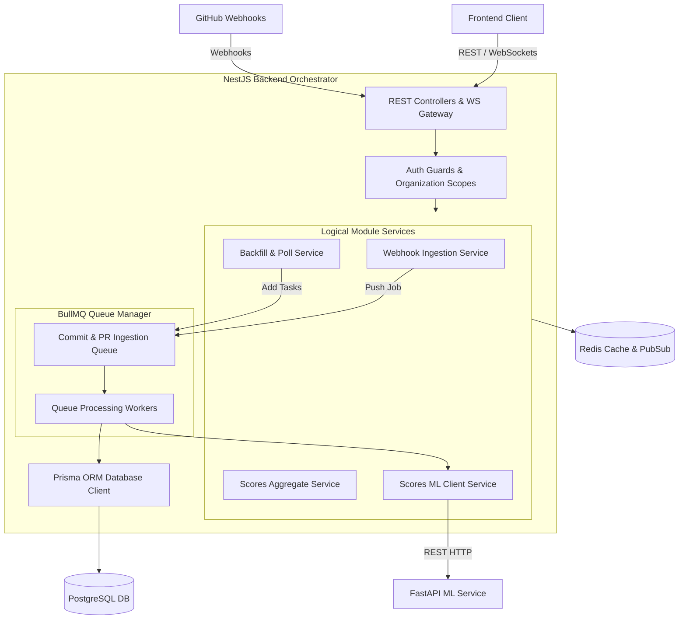
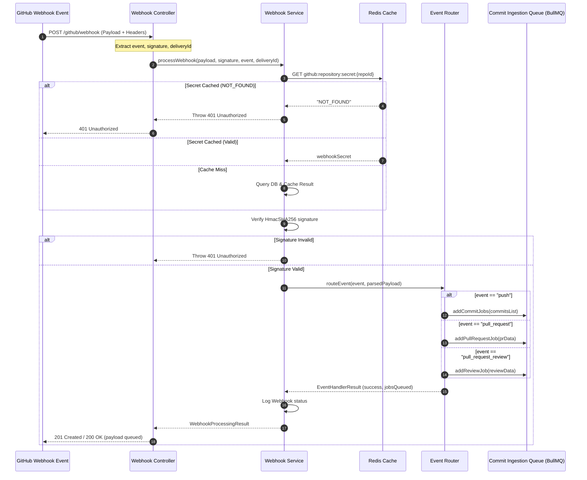

# SQDIS — NestJS Backend Service Technical Reference Manual

This manual provides an in-depth technical reference for the **SQDIS NestJS Backend Service** (`backend`). It explains the **What**, **Why**, and **How** for every core module, database model, security pattern, background worker queue, WebSocket connection, and resiliency fallback.

---

## 1. System Architecture & Component Design

The SQDIS NestJS backend is the central orchestrator of the platform. It handles API requests from the frontend, ingests webhook events from GitHub, manages async task processing via BullMQ queues, handles PostgreSQL database operations (via Prisma ORM), interacts with Redis for caching and pub/sub messaging, and routes machine learning prediction requests to the FastAPI ML service.



---

## 2. Database Schema & Data Models

---

### 2.1 Prisma Schema & Data Mapping

* **WHAT**:
  The relational database schema mapped to PostgreSQL using the Prisma ORM to store developer performance and codebase metrics.

* **WHY**:
  Stores git events and metadata, manages organization memberships, and caches historical DQS and SQS scores for visualization.

* **HOW**:
  The schema defines the following key data models:
  * **`User` & `Organization`**:
    * A `User` represents a developer or admin account.
    * An `Organization` represents the company or workspace.
    * Mapped via `OrganizationMember` (with roles: `OWNER`, `ADMIN`, `MEMBER`, `GUEST`).
  * **`EmailAlias` & `UnmappedEmail`**:
    * `EmailAlias` maps git author emails to a registered `User` account.
    * `UnmappedEmail` logs author emails seen in git commits that have not yet been mapped to a registered user, allowing administrators to link them later.
  * **`Repository` & `Project`**:
    * A `Repository` represents a GitHub repository with settings, last sync times, and webhook secrets.
    * A `Project` aggregates one or more repositories for team assignments and SQS calculation.
  * **`Commit`, `PullRequest`, `Review`, `ReviewComment`**:
    * Represents ingested git entities containing author emails, timestamps, file changes, and comments.
  * **`DQSScore` & `SQSScore`**:
    * Caches score histories, SHAP value explanations, and risky module listings.
  * **`DebtItem` & `Alert`**:
    * `DebtItem` tracks TODO/FIXME comments and AST metrics.
    * `Alert` tracks security and quality warnings.

---

## 3. GitHub Integration & Webhook Ingestion Engine

---

### 3.1 Webhook Verification & DB Starvation DOS Mitigation

* **WHAT**:
  A secure verification system that validates the cryptographic signature of incoming payloads and caches repository configuration metadata.

* **WHY**:
  GitHub webhooks are sent to a public endpoint. Attackers can flood this endpoint with fake signatures or invalid repository IDs. If the backend queries the database for every single invalid request, it quickly exhausts the database connection pool, starving legitimate requests. 
  * **Negative Caching**: By utilizing Redis to store validation states, the backend avoids hitting PostgreSQL for spam or unconfigured repository payloads.

* **HOW**:
  * **Implementation Location**: [webhook.service.ts](file:///d:/FYDP/SQDIS/backend/src/modules/github/services/webhook.service.ts) and [webhook-signature.service.ts](file:///d:/FYDP/SQDIS/backend/src/modules/github/services/webhook-signature.service.ts).
  * **Signature Matching**:
    The signature is sent in the `X-Hub-Signature-256` header as an HMAC-SHA256 signature of the raw payload. The server computes the HMAC of the raw request body using the configured webhook secret and performs a constant-time equality check to prevent timing attacks:
    ```typescript
    const computedSignature = crypto
      .createHmac('sha256', secret)
      .update(rawBody)
      .digest('hex');
    const isValid = crypto.timingSafeEqual(
      Buffer.from('sha256=' + computedSignature),
      Buffer.from(signatureHeader),
    );
    ```
  * **Redis Cache-Aside Pattern**:
    1. Retrieve the repository ID from the JSON payload (`repository.id`).
    2. Check the Redis cache for key `github:repository:secret:${githubId}`.
    3. If cache contains `'NOT_FOUND'`, abort immediately and return `401 Unauthorized`.
    4. If cache contains the secret, run signature verification.
    5. If cache is empty, query PostgreSQL. If found, cache the secret (TTL = 1 hour). If not found, cache the key as `'NOT_FOUND'` (TTL = 5 minutes) and abort.
  * **Result**: Restricts PostgreSQL lookups for invalid repositories to at most once every 5 minutes per unique invalid ID.

---

### 3.2 Webhook Idempotency & Rate Limiting

* **WHAT**:
  Ensures that duplicate webhook deliveries are processed exactly once, and limits incoming webhook rates per repository.

* **WHY**:
  * **Idempotency**: Processing the same commit or pull request multiple times triggers redundant database writes, redundant ML predictions, and corrupted score calculations.
  * **Rate Limiting**: Large repositories with many active developers pushing commits can generate hundreds of webhooks per minute, overloading the ingest queues.

* **HOW**:
  * **Idempotency Service** (`idempotency.service.ts`):
    * Uses the unique `X-GitHub-Delivery` GUID header sent by GitHub as the idempotency key.
    * When a delivery arrives, the server checks Redis for `webhook:idempotency:${deliveryId}`.
    * If found and marked completed, the server immediately returns the cached processing result. If in progress, it blocks or aborts to avoid parallel runs.
    * Successful responses are stored with a 24-hour TTL.
  * **Rate Limit Service** (`rate-limit.service.ts`):
    * Implements a sliding window rate-limiter in Redis using Redis Sorted Sets (`ZSET`).
    * The window stores timestamps of incoming requests per repository:
      ```typescript
      const now = Date.now();
      const windowStart = now - windowSizeMs;
      // Remove requests older than the sliding window size
      await redis.zremrangebyscore(rateLimitKey, 0, windowStart);
      // Count remaining elements in the set
      const requestCount = await redis.zcard(rateLimitKey);
      if (requestCount < maxRequestsLimit) {
        await redis.zadd(rateLimitKey, now, now.toString());
        return { allowed: true };
      }
      return { allowed: false };
      ```
    * Requests exceeding the threshold are rejected with a `429 Too Many Requests` status, and the `Retry-After` header is calculated from the oldest event in the window.

---

### 3.3 Webhook Event Router & Queueing

* **WHAT**:
  An event dispatcher that parses validated webhook payloads and routes them to appropriate async queues.

* **WHY**:
  Separates webhook validation from processing. Webhooks must return a fast response (typically <1s) to GitHub to prevent timeouts and retries, while commit parsing and analysis can take several seconds.

* **HOW**:
  * **Implementation**: [event-router.service.ts](file:///d:/FYDP/SQDIS/backend/src/modules/github/services/event-router.service.ts).
  * **Routing**: Matches the `X-GitHub-Event` header.
    * `push`: Parses the commits array and calls `commitProcessorQueue.addCommitJobs()`.
    * `pull_request`: Evaluates actions; closed and merged PRs are routed to `commitProcessorQueue.addPullRequestJob()`.
    * `pull_request_review`: Routed to `commitProcessorQueue.addReviewJob()`.
    * `pull_request_review_comment`: Routed to `commitProcessorQueue.addReviewCommentJob()`.



---

### 3.4 Asynchronous Backfill Sync Engine

* **WHAT**:
  A system that imports historical repository metadata (commits, pull requests, reviews, code files) for a specific time range (typically 90 days).

* **WHY**:
  Historical sync involves calling the GitHub REST API repeatedly (paginating through hundreds of commits), parsing diffs, fetching file contents, writing to Postgres, and sending files to the AST scanner. If run synchronously within the HTTP request context, it causes Gateway Timeouts (`504`) and consumes resources that block normal API requests.

* **HOW**:
  * **Asynchronous Handler Pattern** ([github.controller.ts](file:///d:/FYDP/SQDIS/backend/src/modules/github/github.controller.ts)):
    The `/repositories/:id/backfill` endpoint resolves the repository existence synchronously and then delegates the backfill execution to a promise chain that runs in the background. It immediately returns a `201 Created` payload:
    ```typescript
    async triggerBackfill(@Param('id') repoId: string, @Query('days') days?: string) {
      const daysNum = days ? parseInt(days, 10) : 90;
      const repository = await this.githubService.getRepository(repoId);
      if (!repository) {
        throw new NotFoundException(`Repository ${repoId} not found`);
      }

      // Trigger backfill asynchronously
      this.backfillService
        .backfillRepository(repoId, daysNum)
        .then((result) => {
          this.logger.log(`Manual backfill completed for ${repoId}: ${result.commitsQueued} commits queued`);
        })
        .catch((error) => {
          this.logger.error(`Manual backfill failed for repository ${repoId}: ${error}`);
        });

      return {
        success: true,
        message: 'Backfill process initiated in the background.',
      };
    }
    ```
  * **Paginated API Sync** ([backfill.service.ts](file:///d:/FYDP/SQDIS/backend/src/modules/github/services/backfill.service.ts)):
    * Evaluates the requested sync window (e.g. `now() - 90 days`).
    * Queries the GitHub API with pagination (`octokit.paginate`) to retrieve all commit SHAs within the window.
    * Compares retrieved SHAs against commits already stored in PostgreSQL to identify only new commits.
    * For each new commit, it fetches details (files modified, lines changed, diff hunk) and pushes a job to the BullMQ processing queue in batches of 100 to avoid memory bloat.

---

## 4. Queue Processing Layer (BullMQ)

The backend uses **BullMQ** (powered by Redis) to process CPU-intensive ingestion tasks asynchronously. This isolates long-running tasks from the main HTTP thread, preventing request starvation.

---

### 4.1 `commit-processor` Queue

* **WHAT**:
  A durable task queue powered by Redis that manages commits, pull requests, reviews, and comments processing.

* **WHY**:
  Guarantees that git events are processed in order and provides fault tolerance (jobs are retried if the DB or ML service goes offline).

* **HOW**:
  * **Configuration**: Defined in `commit-processor.queue.ts`. Jobs are retried up to 3 times using an exponential backoff strategy (`delay: 1000, type: 'exponential'`).
  * **Concurrency**: Handled by setting the concurrency limits on the workers, allowing multiple jobs to run in parallel while limiting database connections.

---

### 4.2 Ingestion Workers

* **CommitCommentWorker**:
  * *WHAT*: A worker that processes commit comments.
  * *WHY*: Comments containing code review remarks or feedback are captured to evaluate developer sentiment and identify unresolved quality concerns.
  * *HOW*: Extracts comment text, forwards it to the ML sentiment analyzer, and writes the comment record and sentiment score to the `CommitComment` database table.
* **IssueWorker**:
  * *WHAT*: A worker that processes issue events.
  * *WHY*: Issue creation and closure rates are tracked to calculate overall project bug density and developer maintenance metrics.
  * *HOW*: Walks the issue action payloads, logs state changes to the `Issue` table, and recalculates associated team metrics.
* **PullRequestWorker**:
  * *WHAT*: A worker that processes pull request merges.
  * *WHY*: Merged PRs represent completed features and are used to calculate developer velocity and review turnaround metrics.
  * *HOW*: Extracts branch metadata, base and head commit SHAs, and writes the PR record to the `PullRequest` table, triggering a background DQS update.
* **ReleaseWorker**:
  * *WHAT*: A worker that processes deployment release events.
  * *WHY*: Release frequency is a key DevOps metric for evaluating team performance.
  * *HOW*: Records release metadata to the `Release` and `GitHubRelease` tables and triggers a notification broadcast.

---

## 5. Security: Authentication, Authorization, and Guards

---

### 5.1 JWT Session Management

* **WHAT**:
  A token-based session management system utilizing short-lived access tokens and long-lived refresh tokens.

* **WHY**:
  Secures endpoints and prevents session hijacking without requiring database lookups for every request.

* **HOW**:
  * **Access Token**: Short-lived (15 minutes), signed with `HS256`. Stored in memory on the client. Contains the user's UUID (`sub`), email, organization, and role.
  * **Refresh Token**: Long-lived (7 days), stored in the `RefreshToken` database table and sent to the client in a secure, `httpOnly` cookie. Used to rotate access tokens. When a user logs out, the refresh token is deleted from the database.

---

### 5.2 RolesGuard & Custom Decorators

* **WHAT**:
  A guard that restricts access to endpoints based on user roles (`OWNER`, `ADMIN`, `MEMBER`, `GUEST`).

* **WHY**:
  Protects administrative endpoints (e.g., repository settings, user management, and manual sync triggers).

* **HOW**:
  * **Decorator**: `@Roles(...)` metadata decorator stores allowed roles on the route handler.
  * **Guard**: `RolesGuard` implements `CanActivate`. It reads the route's allowed roles using NestJS `Reflector` and verifies if the user's role (extracted from the JWT payload) matches one of the allowed roles:
    ```typescript
    const requiredRoles = this.reflector.getAllAndOverride<Role[]>('roles', [context.getHandler(), context.getClass()]);
    if (!requiredRoles) return true;
    const { user } = context.switchToHttp().getRequest();
    return requiredRoles.includes(user.role);
    ```

---

### 5.3 Organization Scope Guard

* **WHAT**:
  A security guard that validates that a user belongs to the organization scope of the resource they are accessing.

* **WHY**:
  Prevents cross-tenant data access. A user from Organization A should not be able to view projects or repositories belonging to Organization B.

* **HOW**:
  * The guard intercepts requests containing an organization, project, or repository ID parameter.
  * It queries the database to confirm if the resource belongs to the organization and validates that the authenticated user has a corresponding `OrganizationMember` record. If not, it throws a `403 Forbidden` exception.

---

## 6. WebSocket Real-Time Event System

---

### 6.1 Handshake Authentication

* **WHAT**:
  Verifies the JWT token during the initial WebSocket handshake before establishing a connection.

* **WHY**:
  Prevents unauthenticated clients from connecting to the WebSocket server and receiving sensitive updates.

* **HOW**:
  * **Extraction**: Extracts the token from the handshake payload (`client.handshake.auth.token`) or query parameters.
  * **Validation**: Calls `jwtService.verify(token)`. If valid, it binds user metadata to the socket session. If invalid, it emits an `error` event and calls `client.disconnect()`.

---

### 6.2 Session Eviction Timer

* **WHAT**:
  An automatic connection eviction timer that disconnects client sockets immediately when their underlying JWT expires.

* **WHY**:
  If a client connects with a JWT that is valid at the time of connection but expires during the session, the connection can persist indefinitely. This allows users whose access has been revoked (or whose session has expired) to continue receiving real-time updates.

* **HOW**:
  * **Connection**: Retrieves the token's expiration claim (`exp`). Registers a timeout for the remaining token lifetime:
    ```typescript
    const timeToExpiration = (payload.exp * 1000) - Date.now();
    const timeout = setTimeout(() => {
      client.emit('error', { message: 'Token expired', code: 'AUTH_EXPIRED' });
      client.disconnect();
    }, timeToExpiration);
    (client as any).authTimeout = timeout;
    ```
  * **Disconnection**: Clears the registered timeout on client disconnect to prevent memory leaks:
    ```typescript
    const authTimeout = (client as any).authTimeout;
    if (authTimeout) clearTimeout(authTimeout);
    ```

---

### 6.3 Channel Subscription & Event Routing

* **WHAT**:
  Organizes connected clients into Socket.io rooms to route real-time updates to authorized users.

* **WHY**:
  Avoids broadcasting sensitive metrics to unauthorized clients.

* **HOW**:
  * **Subscription**: The gateway handles subscription events:
    * `subscribe:dashboard`: Verifies organization membership and calls `client.join("dashboard:orgId")`.
    * `subscribe:team`: Joins team-specific rooms.
    * `subscribe:developer`: Joins developer-specific rooms.
  * **Event Routing**: When a database change occurs (e.g. score calculation completes), the backend calls the gateway's broadcast methods, targeting the corresponding room (e.g. `this.server.to("dashboard:orgId").emit("score:updated", event)`).

---

## 7. Scores Aggregator & ML Microservice Client

---

### 7.1 Scores ML Client Service

* **WHAT**:
  The interface between the NestJS backend and the FastAPI ML service.

* **WHY**:
  Normalizes feature data, makes REST requests to the ML service, and handles communication errors.

* **HOW**:
  * **Features Vector Compilation**: Queries PostgreSQL to compile the 30-day developer metrics and project metrics.
  * **Bounding & Normalization**: Clamps variables (e.g. churn to `[0.0, 1.0]`, test coverage to `[0.0, 100.0]`) to align with ML model expectations.
  * **API Requests**: Calls the `/api/ml/dqs/predict`, `/api/ml/sqs/predict`, and `/api/ml/code-quality/analyze` endpoints using the standard `fetch` API.

---

### 7.2 Local Fallback Heuristics (High Availability)

* **WHAT**:
  A local scoring engine implemented directly within the NestJS client service that calculates DQS and SQS scores if the FastAPI ML service is unreachable.

* **WHY**:
  The ML service can become unavailable due to network partition errors, container restarts, or deployment crashes. Returning `null` or throwing an exception stops all score updates, which degrades the user experience. By implementing identical scoring heuristics locally, the backend can continue to compute scores and save them to PostgreSQL during downtime.

* **HOW**:
  * **DQS Fallback Heuristic** (`predictDQSHeuristic`):
    Uses a rule-based formula that mimics the ML model's baseline calculation and simulates SHAP feature impacts:
    ```typescript
    let score = 70.0;
    score += Math.min((features.commit_count_30d / 30.0) * 10.0, 10.0);
    score += (features.coverage_avg / 100.0) * 15.0;
    score += Math.min((features.review_count / 10.0) * 10.0, 10.0);
    score -= features.bug_fix_ratio * 20.0;
    score -= features.code_churn * 15.0;
    score -= Math.min((features.review_turnaround_avg / 24.0) * 10.0, 10.0);

    const finalScore = Math.max(0.0, Math.min(100.0, score));
    ```
    * **Simulated SHAP**: Generates SHAP impacts relative to a standard baseline:
      * `commit_count_30d` baseline = 15, impact multiplier = 0.33, clamped between $[-5.0, 5.0]$.
      * `coverage_avg` baseline = 50.0, impact multiplier = 0.15.
      * `review_count` baseline = 5, impact multiplier = 1.0, clamped between $[-5.0, 5.0]$.
      * `bug_fix_ratio` baseline = 0.2, penalty multiplier = -20.0.
      * `code_churn` baseline = 0.3, penalty multiplier = -15.0.
      * `review_turnaround_avg` baseline = 12.0, penalty multiplier = -0.42, clamped between $[-10.0, 5.0]$.
  * **SQS Fallback Heuristic** (`predictSQSHeuristic`):
    Calculates SQS using project aggregates and returns risky modules and recommendations:
    ```typescript
    let score = 50.0;
    score += (features.avg_dqs / 100.0) * 30.0;
    score += (features.coverage / 100.0) * 25.0;
    score -= features.churn_rate * 15.0;
    score -= Math.min((features.debt_count / 10.0) * 10.0, 10.0);
    score -= Math.min(features.bug_density * 20.0, 20.0);

    const finalScore = Math.max(0.0, Math.min(100.0, score));
    ```
    * **Risk Scanner**: Calculates folder risk scores and maps values $\ge 0.7$ to `CRITICAL`, $\ge 0.5$ to `HIGH`, and $\ge 0.3$ to `MEDIUM`.
  * **Integration**:
    Calls to the ML service are wrapped in `try-catch` blocks. If the response is not `ok` or a network exception is thrown, the catch block logs a warning and calls the local fallback method:
    ```typescript
    try {
      const response = await fetch(`${this.mlServiceUrl}/api/ml/dqs/predict`, { ... });
      if (!response.ok) return this.predictDQSHeuristic(features, developerId);
      return await response.json();
    } catch (error) {
      this.logger.warn(`Failed to predict DQS: ${error}. Using client fallback.`);
      return this.predictDQSHeuristic(features, developerId);
    }
    ```

---

## 8. Caching & Redis Coordination Layer

---

### 8.1 Caching Policy

* **WHAT**:
  A Redis-based caching layer that stores frequently accessed metrics and configuration secrets.

* **WHY**:
  Reduces database load, avoids redundant API calls, and speeds up page load times for dashboard users.

* **HOW**:
  * **Key Structure**: Uses descriptive prefixes (`dqs:score`, `sqs:score`, `github:repository:secret`).
  * **TTL Policies**:
    * Leaderboard data: 5 minutes (`LEADERBOARD: 300`).
    * Scores and explanations: 1 hour (`DQS_SCORE: 3600`, `EXPLANATION: 3600`).
    * Repository secrets: 1 hour. On misses, negative cache holds `NOT_FOUND` for 5 minutes to mitigate spam.

---

### 8.2 Cross-Instance Coordination (Pub/Sub)

* **WHAT**:
  A Redis Pub/Sub message broker that coordinates cache invalidation events across multiple backend instances.

* **WHY**:
  In a multi-instance deployment, score changes processed on Instance A will not automatically invalidate caches on Instance B, resulting in stale data.

* **HOW**:
  * **Publishing**: When a score is updated on Instance A, it publishes a message containing the entity type and ID to the `cache:invalidate` channel:
    ```typescript
    await this.redisPublisher.publish('cache:invalidate', JSON.stringify({ type: 'dqs', id: developerId }));
    ```
  * **Subscribing**: All backend instances run a subscriber service (`redis-pubsub-subscriber.service.ts`). Upon receiving an invalidation message, they evict the corresponding key from their local caches:
    ```typescript
    this.redisSubscriber.on('message', (channel, message) => {
      if (channel === 'cache:invalidate') {
        const { type, id } = JSON.parse(message);
        this.cacheService.delete(`${type}:score:${id}`);
      }
    });
    ```

---

## 9. Detailed Reference for Core Application Modules

This section details the implementation details of each remaining modular component under `backend/src/modules/` to ensure a comprehensive reference of all endpoints, database interactions, and service linkages.

---

### 9.1 `alerts` Module

* **WHAT**:
  Tracks, manages, and resolves codebase warnings, quality metrics drops (e.g. DQS/SQS drops below configured thresholds), and critical security vulnerabilities flagged during AST scans.

* **WHY**:
  Developers and project leads need immediate visibility into critical health regressions (such as exposed secrets, new code smells, or severe cyclomatic complexity spikes) to resolve them before they cause production issues.

* **HOW**:
  * **Endpoints**: Exposed in `alerts.controller.ts` (e.g., `GET /organizations/:orgId/alerts` to query alert logs, `POST /alerts/:id/resolve` to manually mark alerts as resolved).
  * **Data Model**: Writes to the `Alert` database table containing attributes like `severity` (`LOW`, `MEDIUM`, `HIGH`, `CRITICAL`), `type` (`SECURITY`, `QUALITY`, `ANOMALY`), `message`, `path` (file references), and resolution details (`resolvedAt`, `resolvedById`).
  * **Triggering**: Subscribes to AST scanning completions and score calculations. If a score drops below the defined threshold or a security vulnerability is identified, `alerts.service.ts` creates an `Alert` record and calls `WebSocketGateway.publishAlertNew` to notify connected clients.

---

### 9.2 `audit` Module

* **WHAT**:
  An immutable audit logging service that records administrative and security-sensitive user actions across the system.

* **WHY**:
  Provides accountability, traceability, and compliance reporting (e.g. SOC2 requirements) by logging when repository settings are changed, users are added/removed, or scores are manually overridden.

* **HOW**:
  * **Interception**: Implements an `AuditInterceptor` or direct service calls from controller actions.
  * **Data Model**: Writes to the `AuditEvent` database table containing `userId`, `action` (e.g. `USER_ROLE_UPDATE`, `PROJECT_CREATE`, `SCORE_OVERRIDE`), `entityType` (e.g. `Project`, `User`), `entityId`, `payload` (JSON representing the changes made), and `ipAddress`.
  * **Querying**: Accessible only by organization owners/admins via `GET /organizations/:orgId/audit-logs`.

---

### 9.3 `bull-board` Module

* **WHAT**:
  A visual UI dashboard integrated directly into the NestJS admin interface to monitor and manage BullMQ queues.

* **WHY**:
  Enables system administrators to inspect, pause, retry, or clear active, failed, delayed, and completed background jobs (such as stuck webhook payloads or large backfills) without querying Redis directly.

* **HOW**:
  * **Integration**: Configured inside `bull-board.module.ts` using the `@bull-board/nestjs` package and adapters.
  * **Security**: Mounted at route `/api/admin/queues` and guarded by `JwtAuthGuard` and `RolesGuard` to strictly restrict access to `OWNER` and `ADMIN` users.
  * **Configuration**: Links to Redis connection settings and dynamically registers the `commit-processor` queue for dashboard tracking.

---

### 9.4 `commits` Module

* **WHAT**:
  Ingests, parses, and manages commit records in the database, tracking code modifications and linking them to files and authors.

* **WHY**:
  Serves as the foundation for DQS features (`commit_count_30d`, `code_churn`, `bug_fix_ratio`) and Anomaly Detection inputs.

* **HOW**:
  * **Data Model**: Operations write to the `Commit` table (storing `sha`, `message`, `committedAt`, `authorEmail`, `repositoryId`) and the `FileChange` table (storing lines added, deleted, and modified per file path per commit).
  * **Prisma Operations**: `commits.service.ts` provides bulk insertion helpers used by the Bull worker. It resolves the commit author by checking `EmailAlias` mappings.

---

### 9.5 `coverage` Module

* **WHAT**:
  Parses and stores statements, branches, and functions test coverage statistics uploaded from CI/CD pipelines (e.g., Jest, Pytest coverage reports).

* **WHY**:
  Tracks test coverage trends over time and calculates the `coverage_avg` feature used in DQS and SQS.

* **HOW**:
  * **Endpoints**: Receives XML/JSON coverage payloads via `POST /repositories/:id/coverage` (authenticated via repository tokens).
  * **Data Model**: Updates the `CoverageModule` table which logs file-level statement coverage percentages and directory-level aggregations.
  * **Calculations**: Provides helper methods to calculate the average test coverage of a given set of modified file paths over a 30-day window.

---

### 9.6 `dashboard` Module

* **WHAT**:
  Aggregates statistics and time-series trends from across projects, sprints, alerts, and scores to feed the unified frontend dashboard.

* **WHY**:
  Reduces frontend complexity by providing a single, optimized backend endpoint for loading the main dashboard metrics, avoiding multiple database queries.

* **HOW**:
  * **Endpoints**: Exposes `GET /organizations/:orgId/dashboard/summary`.
  * **Aggregations**: Computes organization-wide score means, open critical alerts count, active sprint goal statuses, and recent commit velocity graphs. It caches results in Redis with a 5-minute TTL to ensure fast responses.

---

### 9.7 `debt` Module

* **WHAT**:
  Aggregates and tracks outstanding technical debt markers (`TODO` and `FIXME` comments, circular dependencies, code smells) identified during AST analysis.

* **WHY**:
  Technical debt must be quantified so that team leads can schedule refactoring sprints. The count of active debt items is also a critical input to SQS.

* **HOW**:
  * **Data Model**: Writes to the `DebtItem` table, storing `type` (`TODO`, `CODE_SMELL`, `VULNERABILITY`, `CIRCULAR_IMPORT`), `filePath`, `line`, `description`, `severity`, and status (`OPEN`, `RESOLVED`).
  * **Synchronization**: When AST scans complete, the scanner returns debt items. `debt.service.ts` diffs the new items against currently open DB debt records, automatically closing resolved items and opening new ones.

---

### 9.8 `email-aliases` Module

* **WHAT**:
  Maps multiple developer Git email aliases (e.g. `dev@personal.com`, `dev.work@company.com`) to a single user account in the system.

* **WHY**:
  Developers commit using different email configurations. Without mapping, metrics like DQS are split across multiple identities, causing inaccurate scores.

* **HOW**:
  * **Data Model**: Writes to the `EmailAlias` table, storing `email` and the associated `userId`.
  * **Unmapped Emails Log**: If a commit is ingested with an email not found in `EmailAlias`, it is logged in the `UnmappedEmail` table. Admins can review these via `/organizations/:orgId/unmapped-emails` and associate them with existing users.

---

### 9.9 `goals` Module

* **WHAT**:
  Manages OKRs (Objectives and Key Results), targets, and sprint-level goals, linking them to codebase quality scores (e.g. "Target SQS > 80% by end of Q3").

* **WHY**:
  Aligns development goals with codebase health, providing a metric-based tracking framework.

* **HOW**:
  * **Data Model**: Writes to `Goal` (storing goal description, start/end dates, state) and `KeyResult` (storing target metrics, current metrics, and baseline scores).
  * **Snapshot Engine**: A daily cron job (`GoalSnapshot` table) queries active DQS/SQS scores, updating current values in key results and triggering alerts if key results drift off-target.

---

### 9.10 `metrics` Module

* **WHAT**:
  Collects and exposes operational metrics (API latency, active socket counts, Redis hits/misses, queue depths) for monitoring tools like Prometheus and Grafana.

* **WHY**:
  Ensures system observability, allowing operations teams to monitor backend health and detect bottlenecks or outages early.

* **HOW**:
  * **Endpoints**: Exposes a `/metrics` route scraping NestJS performance metrics.
  * **Monitoring**: Integrates with the Prometheus client (`prom-client`), exporting system memory usage, CPU load, active database connection counts, and Redis operations performance.

---

### 9.11 `notifications` Module

* **WHAT**:
  Dispatches notifications (real-time, email digests, web push alerts) to users based on score changes, new alerts, or sprint milestones.

* **WHY**:
  Keeps developers and managers updated on codebase status changes without requiring them to remain logged into the dashboard.

* **HOW**:
  * **Data Model**: Writes to `Notification` (storing recipient, body, type, read status) and `NotificationPreference` (storing channels opted in by user).
  * **Delivery**: When an event occurs (e.g. a DQS score drops by >10 points), `notifications.service.ts` reads the user's preference settings and dispatches the alert via NodeMailer (email), WebSockets, or adds it to the `DigestQueue` for weekly summaries.

---

### 9.12 `onboarding` Module

* **WHAT**:
  Coordinates user, repository, and organization setup workflows.

* **WHY**:
  Ensures a clean, step-by-step setup process for new developers and organizations (e.g., connecting GitHub, mapping emails, setting baselines).

* **HOW**:
  * **Data Model**: Tracks progress in `Onboarding` and `OnboardingMilestone` tables.
  * **Workflow**: Guides users through connecting their GitHub accounts, mapping initial email aliases, defining projects, and triggering the initial repository backfills.

---

### 9.13 `organizations` Module

* **WHAT**:
  Manages tenant organizational structures, billing plans, configurations, and user memberships.

* **WHY**:
  Enforces tenant separation in our SaaS architecture, ensuring each organization maintains complete data isolation.

* **HOW**:
  * **Data Model**: Writes to `Organization` and `OrganizationMember` tables.
  * **Interactions**: Controls licensing limits (e.g., maximum repositories or user seats allowed) and stores default alert thresholds for SQS drops.

---

### 9.14 `projects` Module

* **WHAT**:
  Allows administrators to group multiple repositories into logical "Projects" representing specific products or team scopes.

* **WHY**:
  Enables teams to compute aggregate SQS scores specifically for the repositories that represent their product boundary, rather than combining all organization repositories into a single score.

* **HOW**:
  * **Data Model**: Writes to the `Project` table and maps repositories via `ProjectRepository`.
  * **Aggregation**: When calculating SQS, the client service retrieves repositories linked to the target project, queries metrics for those repositories, and inputs them to the SQS ML prediction model.

---

### 9.15 `releases` Module

* **WHAT**:
  Ingests and logs product deployments and releases.

* **WHY**:
  Measures delivery velocity and calculates deployment frequency metrics.

* **HOW**:
  * **Data Model**: Writes to `Release` and `GitHubRelease` tables.
  * **Triggering**: Webhooks capture release creation events from GitHub. The worker logs the tag name, release description, and associate commits, updating SQS feature metrics.

---

### 9.16 `reports` Module

* **WHAT**:
  Generates detailed codebase health and developer performance reports in PDF, CSV, or Markdown formats.

* **WHY**:
  Provides managers and stakeholders with shareable reports for sprint reviews, board meetings, or performance audits.

* **HOW**:
  * **Endpoints**: Exposes `POST /reports/generate` with options for scope (project, developer, team) and period.
  * **Generation**: Compiles metrics, renders HTML templates, and uses a PDF generator (e.g., Puppeteer) to output printable documents. Logs metadata to the `Report` table.

---

### 9.17 `reviews` Module

* **WHAT**:
  Ingests, parses, and manages pull request reviews and comments.

* **WHY**:
  Calculates the `review_turnaround_avg` and `review_count` features used in DQS calculations.

* **HOW**:
  * **Data Model**: Writes to `Review` and `ReviewComment` tables.
  * **Prisma Operations**: Captures reviews submitted to pull requests, recording timestamps of assignment versus submission to compute review turnaround times.

---

### 9.18 `sprints` Module

* **WHAT**:
  Tracks Agile sprint timelines, linking commit activity, scope creep, and carry-over tasks to active sprints.

* **WHY**:
  Correlates development velocity and codebase health with sprint schedules, helping teams evaluate if rushing to meet sprint commitments affects code quality.

* **HOW**:
  * **Data Model**: Writes to `Sprint`, `SprintReport`, and `SprintCarryOver` tables.
  * **Integrations**: Queries open issues and pull requests when a sprint starts and ends. Calculates metric baselines at sprint boundaries to evaluate code quality changes across sprints.

---

### 9.19 `teams` Module

* **WHAT**:
  Manages developer groups (teams) within an organization.

* **WHY**:
  Enables team-level leaderboards and metrics aggregations (e.g., calculating average DQS scores specifically for the Frontend team).

* **HOW**:
  * **Data Model**: Writes to `Team` and maps developers via `TeamMembership`.
  * **Calculations**: Aggregates DQS scores of member developers to calculate team performance indicators and feeds the team metrics tables.

