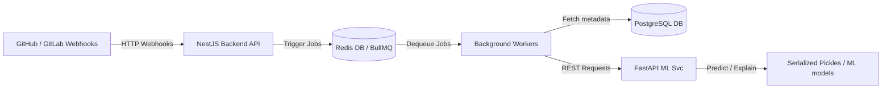
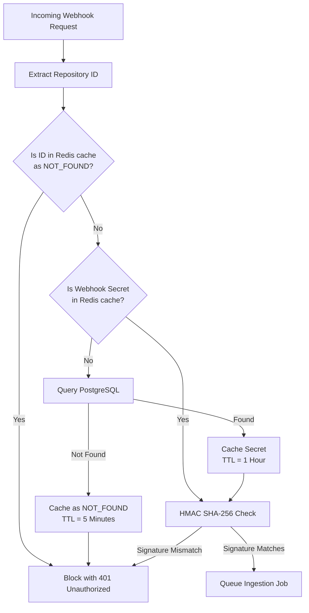
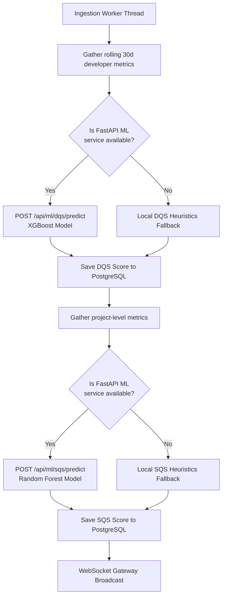
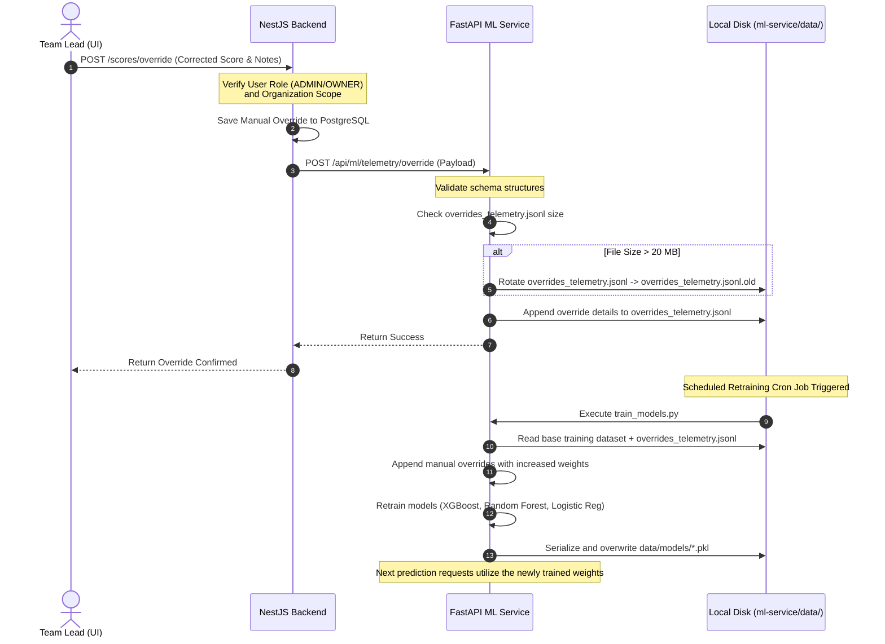

# SQDIS — Backend & Machine Learning Interaction Workflow Guide

This document provides an easy-to-understand, step-by-step walkthrough of the interaction workflow between the **NestJS Backend Service** and the **FastAPI Machine Learning Service**. It traces the path of data from a developer's local machine, through Git, into the ingestion queues, across the ML code scanners, and finally to real-time dashboard updates.

---

## 1. High-Level Integration Architecture

SQDIS uses a **decoupled microservices architecture** where the NestJS backend manages user sessions, transactions, data persistence, and real-time client sockets, while the FastAPI service acts as a dedicated CPU-intensive computational engine for parsing, AST (Abstract Syntax Tree) code scanning, security checks, and machine learning predictions.



---

## 2. In-Depth Step-by-Step Ingestion Workflow

Below is the chronological path a code commit takes through the SQDIS ecosystem.

---

### Step 2.1: Developer Push & Webhook Trigger
1. **Developer Action**: A developer pushes code changes (commits) to a tracked branch (e.g., `main`) on GitHub.
2. **Webhook Event**: GitHub generates a `push` webhook payload containing repository details, author emails, commit messages, and lists of added, removed, and modified files.
3. **HTTP Delivery**: GitHub dispatches a `POST` request to the backend's `/api/github/webhook` endpoint with headers:
   * `X-Hub-Signature-256`: Cryptographic payload signature.
   * `X-GitHub-Event`: Event type (`push`).
   * `X-GitHub-Delivery`: Unique delivery ID.

---

### Step 2.2: Signature Verification & Ingestion Controls



1. **Extraction**: The NestJS `WebhookController` extracts headers and the request body.
2. **Security Lookup**: The webhook service queries the Redis cache for the repository's webhook secret.
   * **Cache Hit (Validated)**: Uses the cached secret.
   * **Cache Hit (Blocked/Negative Cache)**: Aborts immediately with `401 Unauthorized` if the key is cached as `'NOT_FOUND'`.
   * **Cache Miss**: Queries PostgreSQL. If the repository exists and is enabled, the secret is cached (TTL = 1 hour). If it does not exist, Redis caches the repository as `'NOT_FOUND'` (TTL = 5 minutes) to prevent PostgreSQL connection exhaustion (starvation).
3. **HMAC Signature Check**: The backend calculates the HMAC-SHA256 signature of the raw body using the secret and performs a constant-time comparison. If invalid, it blocks the request.
4. **Idempotency & Rate Limit Check**:
   * If the `X-GitHub-Delivery` ID exists in Redis, it returns the cached result.
   * Checks the repository's sliding window rate limit. If allowed, it increments the request counter.
5. **Acknowledge GitHub**: The backend logs the transaction, adds the payload to the queue, and immediately returns a `201 Created` response to GitHub.

---

### Step 2.3: BullMQ Job Queueing & Processing
1. **Task Enqueueing**: The NestJS `EventRouter` routes the payload, adding a commit job to the `commit-processor` queue in Redis.
2. **Worker Dequeue**: A background worker thread picks up the job.
3. **Commit Parsing**: The worker writes the basic commit details (SHA, message, timestamp, author) to the `Commit` and `FileChange` tables.
4. **File Content Retrieval**: The worker calls the GitHub API to fetch the full text content of all modified code files.

---

### Step 2.4: Code Scanning & Security Analysis (NestJS -> FastAPI)
1. **API Call**: The worker constructs a JSON payload containing the files' names and contents, the commit history, and current statement test coverage metrics. It sends a `POST` request to FastAPI's `/api/ml/code-quality/analyze` endpoint.
2. **FastAPI Code Analysis**:
   * **AST Complexity**: Parses Python files into Abstract Syntax Trees, evaluating McCabe Cyclomatic Complexity, Cognitive Complexity, and the Maintainability Index.
   * **JS/TS Lexical metrics**: Scans Javascript/Typescript files using brace-tracking to identify classes, calculating LCOM4 (cohesion) and CBO (coupling).
   * **SAST & Secrets Scanning**: Runs regular expressions to scan for SQL Injection, Command Injection (RCE), weak cryptography, and exposed private keys or Slack webhooks.
   * **Taint Analysis**: Tracks untrusted user inputs (e.g. `request.json`) as they propagate through assignments to database or command execution sinks without sanitization.
   * **Advanced Design Scans**: Detects circular dependency cycles using DFS, checks for copy-pasted duplicate logic (Semantic Clones) using TF-IDF and Cosine Similarity, and assesses Bus Factors for knowledge silos.
3. **Payload Return**: FastAPI returns a `CodeAnalysisResult` containing lists of security alerts, code smells, duplicate blocks, and complexity values.

---

### Step 2.5: ML Score Predictions (XGBoost & Random Forest)



1. **Classifier & Anomaly Check**:
   * NestJS sends the commit message to `/api/ml/classification` to categorize the commit (`BUGFIX`, `FEATURE`, etc.).
   * Sends commit statistics to `/api/ml/anomaly` to determine if the commit represents an outlier (using Isolation Forest).
2. **Developer DQS Calculation**:
   * NestJS aggregates the developer's 30-day metrics (`commit_count_30d`, `bug_fix_ratio`, `code_churn`, `coverage_avg`, `review_count`, `review_turnaround_avg`).
   * Sends the metrics to `/api/ml/dqs/predict`. FastAPI runs the XGBoost Regressor model to calculate the score and uses SHAP to generate explanation values.
   * **Fallback**: If the ML service is offline, NestJS calculates the DQS and SHAP values locally using `predictDQSHeuristic`.
3. **Project SQS Calculation**:
   * NestJS aggregates the project metrics (`avg_dqs`, `coverage`, `churn_rate`, `debt_count`, `bug_density`).
   * Sends the metrics to `/api/ml/sqs/predict`. FastAPI runs the Random Forest Regressor model to calculate the overall project quality score and scan folder-level risks.
   * **Fallback**: If the ML service is offline, NestJS calculates the SQS, risky modules, and recommendations locally using `predictSQSHeuristic`.
4. **Data Persistence**: The computed DQS and SQS scores are stored in PostgreSQL.

---

### Step 2.6: WebSocket Broadcast & Real-Time UI Updates
1. **Trigger**: Once scores are successfully saved, the NestJS service calls the `WebSocketGateway`.
2. **Broadcasting**:
   * Emits `commit:new` containing the commit classification and anomaly status.
   * Emits `score:updated` containing the new SQS and DQS scores.
   * Emits `alert:new` if new critical security issues or score drops were identified.
3. **Target Routing**: Events are routed to Socket.io rooms (e.g. `dashboard:orgId`), ensuring only authorized team members receive the updates.

---

## 3. Retraining Loop & Feedback Workflow

Users can correct or override DQS and SQS scores on the dashboard interface. This overrides the active models, logs feedback to disk, and triggers retraining.



1. **User Override**: A team lead overrides a developer's DQS score (e.g., setting it to 85 because they were dedicated to bug fixes, which had lowered their score).
2. **Audit & Save**: The NestJS backend verifies the user's role, logs an audit trail event (`SCORE_OVERRIDE`), and saves the override in PostgreSQL.
3. **Telemetry POST**: NestJS forwards the telemetry payload (features, original score, corrected score, and notes) to FastAPI's `/api/ml/telemetry/override` endpoint.
4. **Log Rotation**: The ML service checks the size of the telemetry file. If it exceeds 20 MB, it rotates the file to `.old` to prevent disk bloat. It then appends the JSON entry to `data/telemetry/overrides_telemetry.jsonl`.
5. **Retraining**: When the retraining script (`train_models.py`) runs:
   * It loads the base dataset and the logged overrides.
   * Appends the overridden samples to the training set with increased training weights.
   * Retrains the XGBoost and Random Forest models.
   * Overwrites the pickle files (`dqs_model.pkl`, `sqs_model.pkl`), automatically updating active predictions.

---

## 4. API Payload, Database & Cache Schema Reference

To aid developers in debugging and extending the integration, below are the exact data structures passed between the NestJS backend and the FastAPI ML service, as well as the active database and Redis cache mappings.

### 4.1 JSON Payloads

#### A. Code Quality & Security Analysis (`POST /api/ml/code-quality/analyze`)
* **Request Payload**:
```json
{
  "repository_id": "8a72b1c3-61e8-498c-9a4f-563bda4912e8",
  "files": [
    {
      "path": "src/services/auth.ts",
      "content": "const token = process.env.JWT_SECRET || 'fallback-secret';\n..."
    }
  ],
  "git_history": [
    {
      "sha": "99af462f4dbce88e89f81d11b339ba01f8021c33",
      "author_email": "dev@company.com",
      "message": "feat(auth): add JWT signature checks",
      "files_changed": [
        {
          "path": "src/services/auth.ts",
          "lines_added": 25,
          "lines_removed": 5
        }
      ]
    }
  ],
  "coverage_metadata": {
    "src/services/auth.ts": 82.5
  }
}
```
* **Response Payload**:
```json
{
  "complexity": [
    {
      "path": "src/services/auth.ts",
      "cyclomatic_complexity": 4,
      "cognitive_complexity": 2,
      "maintainability_index": 78.4,
      "duplicate_blocks": []
    }
  ],
  "security": [
    {
      "path": "src/services/auth.ts",
      "type": "exposed_secret",
      "severity": "CRITICAL",
      "message": "Exposed generic secret or JWT key found on line 1",
      "line_number": 1
    }
  ],
  "code_smells": [],
  "dependency_cycles": [],
  "semantic_clones": [],
  "taint_issues": []
}
```

#### B. Developer Quality Score (`POST /api/ml/dqs/predict`)
* **Request Payload**:
```json
{
  "developer_id": "d8e37bf1-f6cb-4b2a-89aa-0a002bcbfd20",
  "features": {
    "commit_count_30d": 28,
    "bug_fix_ratio": 0.15,
    "code_churn": 0.22,
    "coverage_avg": 84.6,
    "review_count": 9,
    "review_turnaround_avg": 4.5
  }
}
```
* **Response Payload**:
```json
{
  "score": 88.4,
  "model_version": "2.4.0-xgboost",
  "shap_values": [
    { "feature": "commit_count_30d", "value": 28.0, "impact": 3.2 },
    { "feature": "bug_fix_ratio", "value": 0.15, "impact": 1.5 },
    { "feature": "code_churn", "value": 0.22, "impact": 2.1 },
    { "feature": "coverage_avg", "value": 84.6, "impact": 4.2 },
    { "feature": "review_count", "value": 9.0, "impact": 2.5 },
    { "feature": "review_turnaround_avg", "value": 4.5, "impact": 4.9 }
  ]
}
```

#### C. Software Quality Score (`POST /api/ml/sqs/predict`)
* **Request Payload**:
```json
{
  "project_id": "c1f7a0b3-f09c-48be-86a0-2f9cdb89aa14",
  "features": {
    "avg_dqs": 84.5,
    "coverage": 76.2,
    "churn_rate": 0.18,
    "debt_count": 5,
    "bug_density": 0.12
  },
  "modules": [
    {
      "path": "src/services",
      "churn_rate": 0.35,
      "coverage": 40.0,
      "bug_count": 6,
      "debt_count": 2,
      "lines_of_code": 1200
    }
  ]
}
```
* **Response Payload**:
```json
{
  "score": 81.25,
  "model_version": "1.8.0-random-forest",
  "risky_modules": [
    {
      "path": "src/services",
      "risk_level": "HIGH",
      "reason": "Low test coverage (40.0%) lacks regression protection & High bug fix activity (6 fixes) indicates post-release instability",
      "churn_rate": 0.35,
      "coverage": 40.0,
      "bug_count": 6
    }
  ],
  "recommendations": [
    "Increase automated test coverage. Focus on writing unit tests for modules with low coverage (<50%)."
  ]
}
```

#### D. Telemetry Score Overrides (`POST /api/ml/telemetry/override`)
* **Request Payload**:
```json
{
  "score_type": "DQS",
  "target_id": "d8e37bf1-f6cb-4b2a-89aa-0a002bcbfd20",
  "original_score": 58.5,
  "corrected_score": 80.0,
  "features": {
    "commit_count_30d": 12,
    "bug_fix_ratio": 0.65,
    "code_churn": 0.45,
    "coverage_avg": 95.0,
    "review_count": 14,
    "review_turnaround_avg": 2.1
  },
  "notes": "Developer spent the month resolving high-priority blocker issues, causing artificial bugfix ratio spike."
}
```

---

### 4.2 Redis Cache Keys Reference
The NestJS backend interacts with Redis to handle security caching, rate-limiting, and microservice status logs.

| Cache Key Pattern | Data Type | TTL | Description |
| :--- | :--- | :--- | :--- |
| `webhook:secret:{repoId}` | String | 1 Hour | Stores the repository's HMAC secret key for signature verification. |
| `repo:not_found:{repoId}` | String | 5 Minutes | Negative cache marker. Blocks queries for non-existent repositories, protecting PostgreSQL from starvation DOS attacks. |
| `rate_limit:{repoId}` | String | 1 Hour | Track request counts inside the sliding window to prevent ingestion queues from flooding. |
| `ml_service:available` | Boolean | 30 Seconds | Cached health status of the FastAPI microservice to speed up fallback decisions. |

---

### 4.3 Database Entity Mappings
PostgreSQL (queried via Prisma) maintains relational integrity and persistent history.

* **`Repository`**: Holds configuration details, Git URLs, webhook secrets, and references to active scanning schedules.
* **`Commit`**: Stores the Git commit metadata (hash, author, date, message) and links each commit to its classifier type (`BUGFIX`, `FEATURE`, etc.).
* **`FileChange`**: Records file paths, code diff lengths (added/deleted lines), and complexity metric caches for subsequent scans.
* **`DeveloperQualityScore`**: Stores rolling 30-day DQS scores, individual SHAP impact arrays, and indicates if the calculation was an ML or heuristic fallback result.
* **`SoftwareQualityScore`**: Stores project SQS values, list of detected risky folder modules, and recommended actions.
* **`AuditLog`**: Tracks all user actions, security overrides, token blacklists, and role changes (`SCORE_OVERRIDE`, `API_KEY_REVOKE`).

