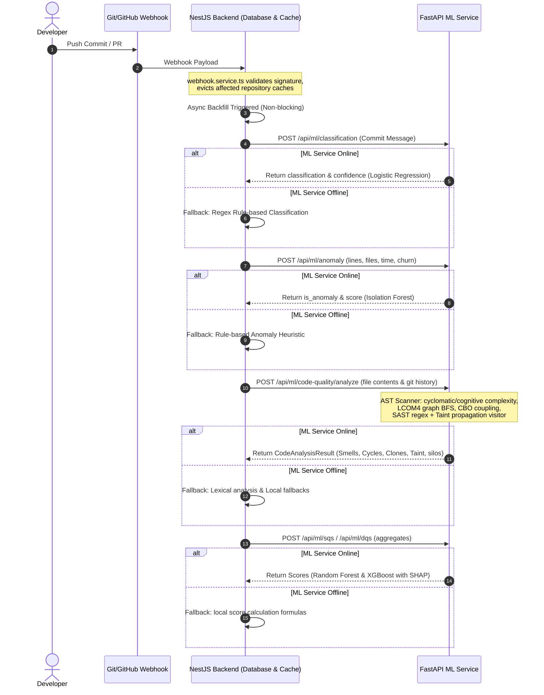

# SQDIS — Machine Learning Service Technical Reference Manual

This manual provides an in-depth technical reference for the **SQDIS Machine Learning Service** (`ml-service`) and its integrations. It details the **What**, **Why**, and **How** for every core metric, model, code scanner, security analyzer, and feedback mechanism.

---

## 1. System Architecture & Request Lifecycle

---

## 2. Developer Quality Score (DQS) Features

The **Developer Quality Score (DQS)** evaluates individual developers over a rolling 30-day window. It uses an **XGBoost Regressor** (falling back to a **Gradient Boosting Regressor** if XGBoost is missing) to calculate a score from `0.0` to `100.0` representing a developer's code quality, testing practices, and review collaboration. Feature impacts are explained using **SHAP (SHapley Additive exPlanations)**.

Below is the technical breakdown of the 6 features extracted from Git repository metadata.

---

### 2.1 `commit_count_30d`

* **WHAT**:
  The total count of distinct Git commits authored by a developer that have been merged or pushed into tracked branches over the last 30 days.

* **WHY**:
  It measures activity volume and coding consistency. A developer with zero or very few commits indicates inactivity or blocking issues, whereas consistent commit counts show steady output.
  * **Trade-offs & Gameability**: Using commit count directly can incentivize developers to make trivial commits (e.g., modifying single lines, fixing formatting in separate commits) to inflate their count. SQDIS mitigates this by applying a cap to the positive contribution of this feature, and by using features like `code_churn` and `bug_fix_ratio` to penalize low-quality, high-volume commits.

* **HOW**:
  * **Database Query**: Prisma queries the `Commit` table filtering by the developer's registered email aliases (from the `EmailAlias` table) to map multiple Git emails to a single user profile. It filters for commits where `committedAt >= now() - 30 days`.
  * **Heuristic Scoring Contribution**:
    $$\text{Commit Score Contribution} = \min\left(\frac{C}{30} \times 10.0, 10.0\right)$$
    where $C$ is the commit count. A volume of 30 commits in 30 days yields the maximum DQS positive addition of 10 points.
  * **Fallback SHAP Value Calculation**:
    $$\text{SHAP}_{\text{commit\_count\_30d}} = \text{clip}\left((C - 15) \times 0.33, -5.0, 5.0\right)$$
    This simulates a linear impact relative to a baseline of 15 commits, clamping the SHAP attribution between $-5.0$ and $+5.0$.

---

### 2.2 `bug_fix_ratio`

* **WHAT**:
  The proportion of a developer's commits classified as `BUGFIX` relative to their total commit count in the rolling 30-day window.
  $$\text{Bug Fix Ratio} = \frac{\text{BUGFIX Commits}}{\text{Total Commits}}$$

* **WHY**:
  High bug fix ratios indicate that a developer's work frequently introduces defects or requires immediate corrections post-merge. A lower ratio suggests higher initial stability, robust local verification, and thorough design before pushing.
  * **Challenges**: Some developers work exclusively on maintenance or bugs. To prevent unfair penalization, the telemetry feedback loop allows team leads to override scores, teaching the ML model to recognize developers assigned specifically to bug-squashing duties.

* **HOW**:
  * **Logic**: During ingestion, every commit message is classified by the ML classifier (or regex fallback). The scores service filters the developer's commits, counts the ones marked as `BUGFIX`, and divides by the total commits.
  * **DQS Deduction**:
    $$\text{Deduction} = \text{bug\_fix\_ratio} \times 20.0$$
    A 100% bug fix ratio deducts the full 20 points from the DQS baseline.
  * **Fallback SHAP Value Calculation**:
    $$\text{SHAP}_{\text{bug\_fix\_ratio}} = -(\text{bug\_fix\_ratio} - 0.2) \times 20.0$$
    This measures deviation from a standard baseline ratio of 0.2 (20% bugs).

---

### 2.3 `code_churn`

* **WHAT**:
  The proportion of code modifications and deletions relative to the total lines changed (added, deleted, and modified) by a developer.
  $$\text{Code Churn} = \frac{\text{Lines Deleted} + \text{Lines Modified}}{\text{Lines Added} + \text{Lines Deleted} + \text{Lines Modified}}$$

* **WHY**:
  Churn measures code stability. High churn indicates a developer is continuously rewriting or refactoring their own code (or recently merged code), which is a sign of unstable requirements, logical churn, or trial-and-error programming.
  * **Refinement**: Moderate churn is normal during active refactoring. Extreme churn ($>0.8$), however, represents high risk and unstable iterations.

* **HOW**:
  * **Calculation**: When commit diffs are parsed, lines added, deleted, and modified are captured per file change. The churn ratio is calculated per commit, clamped to the range `[0.0, 1.0]`, and averaged across all commits.
  * **DQS Deduction**:
    $$\text{Deduction} = \text{code\_churn} \times 15.0$$
    An extremely high churn rate (approaching 1.0) deducts 15 points.
  * **Fallback SHAP Value Calculation**:
    $$\text{SHAP}_{\text{code\_churn}} = -(\text{code\_churn} - 0.3) \times 15.0$$
    Evaluated against a baseline churn of 0.3 (30% churn).

---

### 2.4 `coverage_avg`

* **WHAT**:
  The average statement test coverage percentage of all source code files modified by the developer over the rolling 30-day window.

* **WHY**:
  It checks if the developer is actively writing unit/integration tests for the code they modify. Writing code without corresponding tests increases regression risk.
  * **Challenges**: Developers modifying legacy files with zero coverage will suffer a penalty. This encourages them to write tests for legacy code they touch (scouting rule).

* **HOW**:
  * **Calculation**: The backend scans all file paths modified by the developer's commits. It queries the database to find the latest statement coverage percentage for those files, then calculates the arithmetic mean:
    $$\text{Average Coverage} = \frac{1}{N} \sum_{i=1}^{N} \text{CoveragePercentage}(\text{File}_i)$$
  * **DQS Addition**:
    $$\text{Addition} = \frac{\text{Average Coverage}}{100} \times 15.0$$
    Hitting 100% test coverage across all modified files adds the full 15 points.
  * **Fallback SHAP Value Calculation**:
    $$\text{SHAP}_{\text{coverage\_avg}} = (\text{coverage\_avg} - 50.0) \times 0.15$$
    Evaluated against a baseline test coverage of 50%.

---

### 2.5 `review_turnaround_avg`

* **WHAT**:
  The average time (in hours) a developer takes to submit a review after being requested as a reviewer on a pull request.

* **WHY**:
  Long turnaround times create bottlenecks, build review debt, and slow down code delivery. Responsiveness is a key teamwork and collaboration metric.
  * **Challenges**: Weekend and out-of-office requests can artificially inflate turnaround times. The backend captures raw duration but caps the penalty to avoid over-penalizing outliers.

* **HOW**:
  * **Calculation**: Calculated from the `PullRequestReview` and `PullRequest` metadata. For every PR where the developer was requested as a reviewer:
    $$\text{Turnaround} = \text{Timestamp}_{\text{Submitted}} - \text{Timestamp}_{\text{Requested}}$$
    The service averages these durations across the 30-day window.
  * **DQS Deduction**:
    $$\text{Deduction} = \min\left(\frac{\text{Turnaround}_{\text{Hours}}}{24} \times 10.0, 10.0\right)$$
    Taking 24 hours or longer on average to complete code reviews deducts the maximum 10 points.
  * **Fallback SHAP Value Calculation**:
    $$\text{SHAP}_{\text{review\_turnaround\_avg}} = \text{clip}\left(-(\text{review\_turnaround\_avg} - 12.0) \times 0.42, -10.0, 5.0\right)$$
    Evaluated against a baseline review turnaround time of 12 hours.

---

### 2.6 `review_count`

* **WHAT**:
  The total number of pull request reviews submitted by the developer in the last 30 days.

* **WHY**:
  It measures collaboration and mentoring. Reviewing peer code helps share knowledge, maintain style conventions, and keep the PR queue moving.

* **HOW**:
  * **Calculation**: Count of PR reviews submitted by the developer in the rolling 30-day window.
  * **DQS Addition**:
    $$\text{Addition} = \min\left(\frac{\text{review\_count}}{10} \times 10.0, 10.0\right)$$
    Submitting 10 or more reviews in 30 days adds the maximum 10 points.
  * **Fallback SHAP Value Calculation**:
    $$\text{SHAP}_{\text{review\_count}} = \text{clip}\left((\text{review\_count} - 5) \times 1.0, -5.0, 5.0\right)$$
    Evaluated against a baseline review count of 5.

---

### 2.7 DQS XGBoost Model Integration

* **WHAT**:
  The core ML model calculating DQS by learning non-linear mappings and feature interactions from historical developer data.

* **WHY**:
  Linear formulas fail to capture complex developer patterns (e.g., a high commit count coupled with high churn and high bug ratio represents high risk, whereas high commit count with low churn and high coverage represents high performance). An XGBoost model dynamically weights feature interactions.

* **HOW**:
  * **Model Weights & Serialization**: Saved as a serialized pickle file `data/models/dqs_model.pkl`.
  * **Heuristic Fallback Formula**:
    If the trained XGBoost model is missing, the service uses the following formula to calculate DQS:
    $$\text{DQS} = \text{clip}(70.0 + \text{CommitScore} + \text{CoverageScore} + \text{ReviewScore} - \text{BugDeduction} - \text{ChurnDeduction} - \text{TurnaroundDeduction}, 0.0, 100.0)$$
    * Base Score: `70.0`
    * Additions: Commit Score (max `+10.0`), Test Coverage (max `+15.0`), Review Count (max `+10.0`).
    * Deductions: Bug Fix Ratio (max `-20.0`), Code Churn (max `-15.0`), Review Turnaround (max `-10.0`).

---

## 3. Software Quality Score (SQS) Engine

The **Software Quality Score (SQS)** evaluates codebase risk, maintainability, and regression likelihood at the project level, returning a score from `0.0` to `100.0`. It uses a **Random Forest Regressor** trained on 5 project-level features.

---

### 3.1 Feature Set & Extraction

* **WHAT**:
  The project-level health features aggregate developer performance and codebase metrics:
  1. **`avg_dqs`**: Mean of DQS scores of active developers.
  2. **`coverage`**: Overall statement test coverage percentage.
  3. **`churn_rate`**: Weighted churn rate.
  4. **`debt_count`**: Active technical debt items, dynamically scaled.
  5. **`bug_density`**: Project-level bugfix ratio (range `[0.0, 1.0]`).

* **WHY**:
  Project leads need a unified health score that reflects both code structure and team performance. A codebase with good unit tests but low developer scores remains fragile, while a high-performing team struggling with a low-coverage legacy system has high regression risks.

* **HOW**:
  * **Database Extraction**: Prisma gathers metrics for all active files and commits associated with the project's repositories.
  * **Debt Count Scaling**: Technical debt counts are incremented by AST scanner findings:
    * Each critical/high security vulnerability adds `+2.0` to the debt count.
    * Each circular dependency cycle adds `+3.0` to the debt count.
    * Each major code smell (God Class, CBO > 6, LCOM4 > 1) adds `+1.0` to the debt count.

---

### 3.2 Model Execution & Fallback Heuristic

* **WHAT**:
  The execution of the SQS scoring model and its mathematical rule-based fallback formula.

* **WHY**:
  Ensures the score continues to be calculated even if the Python Random Forest model has not yet been trained or has serialization errors.

* **HOW**:
  If the Random Forest model is not trained or is missing from disk, the SQS engine uses this rule-based heuristic:
  $$\text{SQS} = \text{clip}\left(50.0 + 30.0 \times \left(\frac{\text{avg\_dqs}}{100}\right) + 25.0 \times \left(\frac{\text{coverage}}{100}\right) - 15.0 \times \text{churn\_rate} - \min\left(\frac{\text{debt\_count}}{10.0} \times 10.0, 10.0\right) - \min(\text{bug\_density} \times 20.0, 20.0), 0.0, 100.0\right)$$
  * **Base Score**: `50.0`
  * **Team DQS Impact**: Adds up to `+30.0` points.
  * **Project Coverage Impact**: Adds up to `+25.0` points.
  * **Churn Penalty**: Deducts up to `-15.0` points.
  * **Technical Debt Penalty**: Deducts up to `-10.0` points (capped at 10 debt items).
  * **Bug Density Penalty**: Deducts up to `-20.0` points (calculated from project bugfix ratio).

---

### 3.3 Folder-Level Risk Assessment (Risky Modules)

* **WHAT**:
  An automated scanner identifying specific folders/modules within a project that represent immediate quality or regression risks.

* **WHY**:
  A project-level score can hide localized risks. A single folder (e.g., payment gateways) with high churn and zero test coverage represents a major risk, even if the rest of the project is healthy.

* **HOW**:
  For each folder, the system calculates a risk score from `0.0` to `1.0`:
  $$\text{Module Risk Score} = \min\Big(0.3 \cdot \mathbb{I}(\text{churn\_rate} > 0.4) + 0.3 \cdot \mathbb{I}(\text{coverage} < 50.0) + 0.2 \cdot \mathbb{I}(\text{bug\_count} > 5) + 0.2 \cdot \mathbb{I}(\text{debt\_count} > 5), 1.0\Big)$$
  where $\mathbb{I}(\text{condition})$ is the indicator function.
  * **Risk Mapping**:
    * $\text{Risk Score} \ge 0.7 \Rightarrow \text{CRITICAL}$
    * $\text{Risk Score} \ge 0.5 \Rightarrow \text{HIGH}$
    * $\text{Risk Score} \ge 0.3 \Rightarrow \text{MEDIUM}$
    * $\text{Risk Score} > 0.0 \Rightarrow \text{LOW}$

---

## 4. Commit Classification

---

### 4.1 Logistic Regression Classifier

* **WHAT**:
  A text classifier categorizing commits into: `BUGFIX`, `FEATURE`, `REFACTOR`, `TEST`, and `DOCS`.

* **WHY**:
  Automates the categorization of developer commits to calculate the `bug_fix_ratio` (DQS) and `bug_density` (SQS) features without manual intervention.

* **HOW**:
  * **Text Preprocessing**: The commit message is normalized (converted to lowercase, punctuation removed).
  * **Feature Extraction**: A TF-IDF vectorizer extracts unigrams and bigrams (`ngram_range=(1,2)`) using the pattern `\b\w+\b`.
  * **Classification**: A multi-class Logistic Regression model (with regularization parameter `C=10.0`) predicts class probabilities.
  * **Confidence**: Calculated as the probability of the winning class:
    $$\text{Confidence} = \max_c P(\text{class} = c \mid \text{commit\_message})$$
  * **Pipeline Storage**: Serialized to disk inside `data/models/classification_model.pkl`.

---

### 4.2 Pattern-Matching Rule Fallback

* **WHAT**:
  A regular expression fallback engine used if the serialized Logistic Regression pipeline fails to load.

* **WHY**:
  Ensures that commits are still categorized correctly even during cold starts, model corruptions, or retraining lockouts.

* **HOW**:
  The system matches the commit message against the following regular expression patterns:
  * **BUGFIX**: `\b(fix|bugfix|hotfix|patch)\b`, `\b(bug|issue|error|crash|exception)\b`, `\b(resolve|correct|repair)\b.*\b(bug|issue|error)\b`, `\b(null pointer|undefined|memory leak)\b`
  * **FEATURE**: `\b(feat|feature|add|implement|create)\b`, `\b(new|introduce|support|enable)\b`, `\b(build|develop|integrate)\b`
  * **REFACTOR**: `\b(refactor|restructure|reorganize)\b`, `\b(cleanup|clean up|simplify|optimize)\b`, `\b(improve|enhance|upgrade)\b.*\b(code|structure|logic)\b`, `\b(remove|delete)\b.*\b(dead|unused|deprecated)\b`, `\b(rename|move|extract)\b`
  * **TEST**: `\b(test|tests|testing)\b`, `\b(spec|specs|coverage)\b`, `\b(unit test|integration test|e2e)\b`, `\b(mock|stub|fixture)\b`
  * **DOCS**: `\b(doc|docs|documentation)\b`, `\b(readme|changelog|license)\b`, `\b(comment|comments|docstring)\b`, `\b(wiki|guide|tutorial|example)\b`
  * **File Scope Scoring**: Modifying files with names containing `.test.`, `test_*.py`, or in folders like `tests/` adds points to `TEST`. Modifying markdown (`.md`), documentation (`.rst`), or files in `docs/` adds points to `DOCS`. The class with the highest combined message and file score is selected.

---

## 5. Anomaly Detection

---

### 5.1 Isolation Forest Anomaly Detector

* **WHAT**:
  An unsupervised machine learning model that flags commits that deviate significantly from standard developer behavior.

* **WHY**:
  High-risk commits (e.g., massive file changes, force-pushes, or changes committed in the middle of the night) are common sources of regressions, system instability, and security vulnerabilities.

* **HOW**:
  * **Model**: Scikit-learn's `IsolationForest` initialized with 100 trees (`n_estimators=100`) and a expected contamination factor of 10% (`contamination=0.1`).
  * **Feature Vector**: $X = [\text{lines\_changed}, \text{files\_changed}, \text{time\_of\_day}, \text{churn\_ratio}]$.
  * **Anomaly Score**:
    $$\text{Anomaly Score} = \text{clip}(0.5 - \text{decision\_function}(X), 0.0, 1.0)$$
    An anomaly score $\ge 0.6$ labels the commit as anomalous (`is_anomaly = True`).
  * **Severity Mapping**:
    * $\text{Score} \ge 0.9 \Rightarrow \text{CRITICAL}$
    * $\text{Score} \ge 0.7 \Rightarrow \text{HIGH}$
    * $\text{Score} \ge 0.5 \Rightarrow \text{MEDIUM}$
    * $\text{Score} < 0.5 \Rightarrow \text{LOW}$
  * **Model Storage**: Serialized to disk inside `data/models/anomaly_model.pkl`.

---

### 5.2 Heuristic Fallback Rules

* **WHAT**:
  A rule-based scoring fallback used if the Isolation Forest model is not trained or cannot be loaded.

* **WHY**:
  Avoids system failure on startup, ensuring that commits are evaluated for anomalies immediately after onboarding before historical data is available.

* **HOW**:
  Calculates a score using static rules:
  * Start with a baseline score of `0.1`.
  * Add `+0.4` if `lines_changed` > 5000 (or `+0.2` if > 1000).
  * Add `+0.3` if `files_changed` > 100 (or `+0.15` if > 30).
  * Add `+0.2` if the commit hour is between 2:00 AM and 5:00 AM (dead of night commits).
  * Add `+0.1` if `churn_ratio` > 0.95 (nearly pure code deletion or rewrite).
  * The final score is capped at `1.0`. A score $\ge 0.6$ flags the commit as anomalous.

---

## 6. Abstract Syntax Tree (AST) Code Quality Scanner

The AST scanner parses source code into abstract syntax trees to calculate complexity, structural, and cohesion metrics.

---

### 6.1 Python Complexity & Maintainability Analysis

* **WHAT**:
  A parser that computes McCabe Cyclomatic Complexity, Cognitive Complexity, and the Maintainability Index for Python files.

* **WHY**:
  Measures code readability and maintainability. High cyclomatic complexity makes code hard to test, deep nesting increases cognitive load, and low maintainability indices signal refactoring needs.

* **HOW**:
  * **Cyclomatic Complexity**: Walks the AST. Starts at `1` and increments for each conditional branch: `If`, `For`, `While`, `AsyncFor`, `ExceptHandler`, `BoolOp` (boolean `and`/`or` nodes), and comprehensions (`ListComp`, `DictComp`, `SetComp`).
  * **Cognitive Complexity**: Tracks nesting depth. Entering a block (`If`, `For`, `While`, `ExceptHandler`) increases the nesting level by 1. Each nested conditional or loop adds the current nesting level to the cognitive score.
  * **Maintainability Index (MI)**:
    Uses the Cyclomatic Complexity ($CC$), Halstead Volume ($V$), and Physical Lines of Code ($LOC$):
    $$MI = \max\left(0, \frac{171 - 5.2 \cdot \ln(V) - 0.23 \cdot CC - 16.2 \cdot \ln(LOC)}{171} \times 100\right)$$
    * $V = \text{length} \times \log_2(\text{vocabulary})$, where $\text{length}$ is the total number of operators and operands, and $\text{vocabulary}$ is the count of unique operators and operands.
    * Categorized: $>65 \Rightarrow$ High, $20-65 \Rightarrow$ Moderate, $<20 \Rightarrow$ Low.

---

### 6.2 JS/TS Structural Metrics (LCOM4 & CBO)

* **WHAT**:
  A lexical analyzer that extracts classes, methods, and variables from JS/TS files to calculate LCOM4 (cohesion) and CBO (coupling).

* **WHY**:
  Enforces single-responsibility and loose-coupling principles. High LCOM4 values indicate a class is trying to do too many things, and high CBO values show excessive coupling, making the code fragile and hard to test.

* **HOW**:
  * **LCOM4 Graph BFS Connected Components**:
    1. Parse the class to identify fields (attributes) and methods.
    2. Build an undirected graph $G = (V, E)$ where the vertices $V$ represent methods.
    3. Add an edge $(m_1, m_2) \in E$ if methods $m_1$ and $m_2$ reference the same field, or if one method calls the other.
    4. Calculate the number of connected components in the graph using a Breadth-First Search (BFS):
       * Maintain a `visited` set.
       * Loop through all methods. If a method is unvisited, increment the `components` count and run a BFS traversal (using a queue to find all connected neighbors).
    5. The count of connected components is the LCOM4 score.
  * **CBO (Coupling Between Objects)**:
    * Extracts all capitalized words representing class instantiations or static calls (e.g., `new UserService()`, `DatabaseClient.query()`).
    * Filters out language-builtin types (e.g., `Object`, `Array`, `Promise`, `String`, `Console`) and the class's own name or base class.
    * The count of remaining unique classes is the CBO score. Values $>6$ trigger a coupling warning.

---

## 7. SAST & Taint Analysis

---

### 7.1 SAST (Static Application Security Testing)

* **WHAT**:
  A pattern-matching security scanner that checks source files for vulnerabilities and exposed secrets.

* **WHY**:
  Identifies vulnerabilities (such as SQL Injection, Command Injection, and exposed credentials) before code is merged.

* **HOW**:
  Scans code files line-by-line using regular expressions:
  * **SQL Injection**: `(execute|query|select|db_query)\s*\(.*([%+].*|f\".*\{.*\}.*\")`
  * **Dangerous Execution**: `\b(eval|exec|subprocess\.Popen|subprocess\.run)\s*\(.*(shell\s*=\s*True|compile|\bsh\b|\bbash\b)`
  * **Weak Cryptography**: `\b(hashlib\.md5|hashlib\.sha1|MD5|SHA1)\b`
  * **Insecure Binding**: `['"]0\.0\.0\.0['"]`
  * **Private Keys**: `-----BEGIN\s+(RSA\s+)?PRIVATE\s+KEY-----`
  * **Slack Webhooks**: `https://hooks\.slack\.com/services/T[A-Z0-9_]{8}/B[A-Z0-9_]{8}/[A-Za-z0-9_]{24}`
  * **Generic Secrets**: `\b(aws_access_key_id|aws_secret_access_key|api_key|secret_key|jwt_secret|oauth_token)\b\s*=\s*['"][A-Za-z0-9+/=_\-\.]{16,}['"]`

---

### 7.2 Taint Analysis

* **WHAT**:
  A data-flow analysis engine that tracks user-controlled inputs (sources) to ensure they do not reach dangerous functions (sinks) without being sanitized.

* **WHY**:
  Regex scanners generate false positives. Taint analysis traces data flow, confirming if user inputs actually reach execution blocks without sanitization.

* **HOW**:
  * **Sources**: Functions or properties returning user-controlled data:
    `input`, `request.args`, `request.json`, `request.form`, `request.values`, `request.data`, `request.get_json`, `request.body`, `params`, `query_params`.
  * **Sinks**: Vulnerable functions that execute commands or run queries:
    `execute`, `query`, `eval`, `exec`, `subprocess.Popen`, `subprocess.run`, `os.system`.
  * **Sanitizers**: Functions that clean or cast variables:
    `int`, `float`, `escape`, `sanitize`, `str_to_int`, `int_to_str`.
  * **Algorithm**:
    1. **Taint Initialization**: When the visitor encounters an assignment (`ast.Assign`), it checks if the value on the right-hand side is a taint source. If so, it adds the left-hand side variable name to the active `tainted_vars` set.
    2. **Taint Propagation**: For subsequent assignments, if any variable on the right-hand side is in `tainted_vars`, the left-hand side variable is marked as tainted. If a variable is assigned a safe value (or wrapped in a sanitizer function), it is removed from `tainted_vars`.
    3. **Sink Verification**: When a function call (`ast.Call`) is encountered, the scanner checks if the function name matches a registered sink. If any argument in the call is marked as tainted, a critical vulnerability issue (`TaintIssue`) is raised.

---

## 8. Advanced Design Scans

---

### 8.1 Circular Dependencies

* **WHAT**:
  Detects circular import cycles (e.g., File A imports File B, which imports File A).

* **WHY**:
  Circular dependencies couple modules tightly, hinder testability, and can cause runtime exceptions or memory leaks.

* **HOW**:
  1. Build a directed dependency graph $G = (V, E)$, where the vertices $V$ represent files and the edges $(f_1, f_2) \in E$ represent imports.
  2. For Python files, imports are resolved by parsing `ast.Import` and `ast.ImportFrom` nodes. For Javascript/Typescript files, a lexical scan searches for `import` or `require` regex matches.
  3. Cycle detection is performed using a Depth-First Search (DFS) traversal:
     * Maintains a recursion stack (`path_stack`) and a `visited` dictionary mapping nodes to states (0 = unvisited, 1 = visiting, 2 = visited).
     * If a neighbor node in state 1 (visiting) is encountered, a cycle is identified. The path of the cycle is extracted from the recursion stack.

---

### 8.2 Semantic Clones

* **WHAT**:
  Identifies files that contain similar logic, even if variables, function names, or formatting differ.

* **WHY**:
  Copy-paste development increases maintenance costs. Changes in one version of the logic must be duplicated in all clones.

* **HOW**:
  1. Convert all repository files into a text corpus.
  2. Convert the corpus into a term-document matrix using a **TF-IDF Vectorizer**:
     * Splits code using the regex token pattern `\b\w+\b` to capture identifiers and keywords.
  3. Compute the **Cosine Similarity** between all file vector pairs:
     $$\text{Similarity}(A, B) = \frac{A \cdot B}{\|A\| \|B\|}$$
  4. Pairs with a similarity score $>0.85$ are flagged as semantic clones.

---

### 8.3 Knowledge Decay & Silo Mapping

* **WHAT**:
  Evaluates codebase bus-factor and identify silos where only a single developer understands a file.

* **WHY**:
  Silos increase project risk. If the sole maintainer of a critical file leaves or is unavailable, bug fixes and feature development can be delayed.

* **HOW**:
  * **Bus Factor**: The minimum number of developers whose combined contributions account for $\ge 80\%$ of the commits for a given file. A Bus Factor of 1 indicates a knowledge silo.
  * **Decay Score**: Measures the elapsed time since the file's primary author last committed to the repository:
    $$\text{Decay Score} = \min\left(1.0, \frac{\text{inactive\_commits}}{25.0}\right)$$
    where `inactive_commits` is the number of commits added to the project since the primary author's last commit. If the primary author has been inactive for more than 12 commits, the decay score increases, signaling a loss of active knowledge.

---

### 8.4 JIT Commit Risk Assessment

* **WHAT**:
  Calculates a risk score from `0.0` to `100.0` for each commit before it is merged.

* **WHY**:
  Allows teams to identify high-risk changes and enforce additional review or testing constraints.

* **HOW**:
  The risk score is calculated as the sum of four sub-scores (each capped at `25.0` points):
  1. **Churn Scatter**: Evaluates the spread of the change:
     $$\text{Scatter Score} = \min(\text{files\_changed} \times 4.0, 25.0)$$
  2. **Author Experience**: Evaluates the author's familiarity with the codebase:
     $$\text{Experience Score} = \max(0.0, 25.0 - (\text{author\_historical\_commits} \times 4.0))$$
  3. **File Churn Risk**: Evaluates if the commit touches historically unstable files:
     $$\text{Churn Score} = \min(\max_{f \in \text{files}}(\text{file\_historical\_churn}) \times 3.0, 25.0)$$
  4. **Message Sentiment & Urgency**: Uses VADER sentiment analysis to evaluate the commit message:
     * A negative compound sentiment score (< -0.1) adds up to `+15.0` points.
     * The presence of urgent keywords (e.g., `panic`, `hotfix`, `temp`, `hack`, `workaround`, `skip`) adds `+5.0` points per keyword (capped at `+10.0`).
     * Very short messages (< 10 characters) add `+5.0` points.

---

## 9. Retraining Loop & Telemetry Feedback

The ML service implements a feedback loop to capture user feedback and retrain models over time.

---

### 9.1 Telemetry Logging Schema

* **WHAT**:
  Appends manual score overrides submitted from the frontend UI to a telemetry file.

* **WHY**:
  Logs developer feedback and score corrections to train subsequent model iterations, improving prediction accuracy over time.

* **HOW**:
  Logged to `data/telemetry/overrides_telemetry.jsonl` in JSON Lines format:
  * Contains fields: `timestamp`, `score_type`, `target_id`, `original_score`, `corrected_score`, `features` vector, and manual correction `notes`.

---

### 9.2 Log Rotation

* **WHAT**:
  An automatic log rotation mechanism for the telemetry files on disk.

* **WHY**:
  Prevents disk space exhaustion by keeping telemetry files within a fixed size limit.

* **HOW**:
  * Prior to writing any override entry, the telemetry logger checks the file size.
  * If the size of `overrides_telemetry.jsonl` exceeds **20 MB**, it is renamed to `overrides_telemetry.jsonl.old` (overwriting the previous backup).
  * A new, empty `overrides_telemetry.jsonl` file is created.

---

### 9.3 Model Retraining Pipeline

* **WHAT**:
  A pipeline that retrains the DQS, SQS, and Anomaly detection models using telemetry data.

* **WHY**:
  Ensures the models incorporate human corrections, adapting predictions to organization-specific development styles over time.

* **HOW**:
  * **Triggering**: The retraining scripts (`train_models.py` and `train_anomaly.py`) are scheduled as periodic cron jobs or can be triggered manually.
  * **Training Steps**:
    1. Read the base training dataset.
    2. Parse `overrides_telemetry.jsonl` to extract corrections.
    3. Append corrections to the training matrix with increased weights to prioritize user corrections.
    4. Retrain the model.
    5. Validate predictions and serialize the updated models to `data/models/` as pickle files, replacing the active model files.
